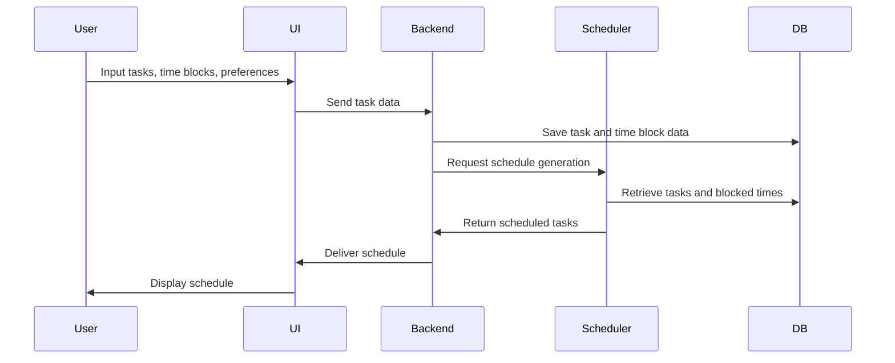

# System Design for **Ordo** – Intelligent Task Scheduler

## Introduction

This document outlines the system architecture of **Ordo**, a smart and student-friendly Task Scheduler application. Users input their tasks and **Ordo** schedules them efficiently using a custom in-house algorithm. The system ensures dependencies, priorities, and user preferences are respected while delivering an optimized and personalized schedule.

---

## Functional Components

### Task Input Module

* Allows users to input tasks with all necessary attributes.
* Supports subtasks and dependency definition.
* Enables users to specify if fragmentation of tasks is allowed.

### Time Blocking Module

* Users can input fixed blocks (e.g., college timetable).
* Emergency blocks can be defined dynamically to block off upcoming time.

### Scheduling Engine

* Implements **Ordo**’s custom scheduling algorithm.
* Respects dependencies between tasks and subtasks.
* Respects user-defined priorities and deadlines.
* Honors fragmentation constraints.
* Accounts for blocked time slots.
* Optionally schedules flexible tasks within user-defined time windows.

### AI Parsing Module (Optional)

* Parses uploaded timetable images.
* Extracts time blocks and adds them to the time blocking module.
* Uses AI/ML techniques such as OCR and image classification.

---

## Scheduling Algorithm Overview

The heart of **Ordo** lies in its scheduling algorithm, which receives:

* A set of tasks with durations, dependencies, priorities, and deadlines.
* A set of blocked time intervals.
* Fragmentation preferences.

The output is a feasible schedule mapping each task or subtask to specific time intervals that respect constraints and optimize user priorities.

---

## Sequence Diagram for Scheduling Process

---

## Possible Extensions

* **Flexible Tasks**: Tasks that can be scheduled anytime within a specified window.
* **AI-enhanced Parsing**: Improve timetable image processing accuracy.
* **Notification System**: Alerts for upcoming tasks or blocked time adjustments.
* **Collaboration Features**: Shared schedules and task assignments.

---

## Conclusion

With a modular and extensible architecture, **Ordo** delivers a student-oriented scheduling experience that balances academic priorities and personal preferences. Its intelligent scheduling engine provides clarity, control, and confidence in managing time effectively.
